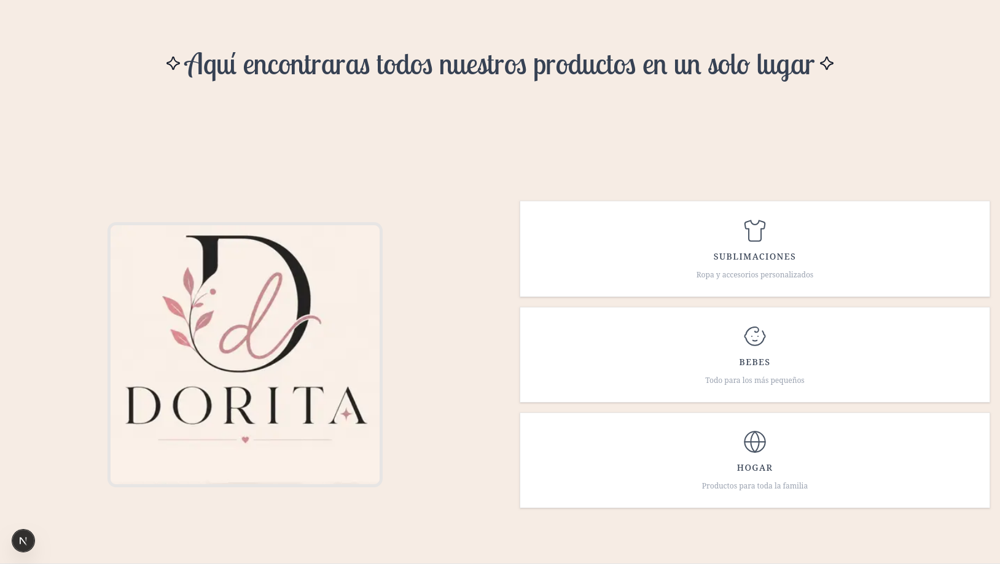
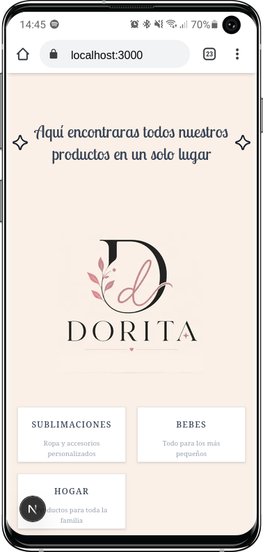

# That's my first "Paid" services as a web Developer :)
## Getting Started

First, run the development server (Obviusly):

```bash
bun run dev <---- For performanence
# or
npm run dev
# or
yarn dev
# or
pnpm dev
# or
bun dev
```

Open [http://localhost:3000](http://localhost:3000) with your browser to see the result.
Also u can  see the app on the following domain: (Oh really, thats project don't  have a domain yet)

You can start editing the page by modifying `app/page.tsx`. Sorry if it have bugs haha :)

## How it works? 
**IDK, but it works 0.0**

Just kidding, first, when u enter to the website, u can see
a menu (That's  in Spanish cause me and my client speak Spanish)
There  is a  picture: (PC)

(Mobile)

